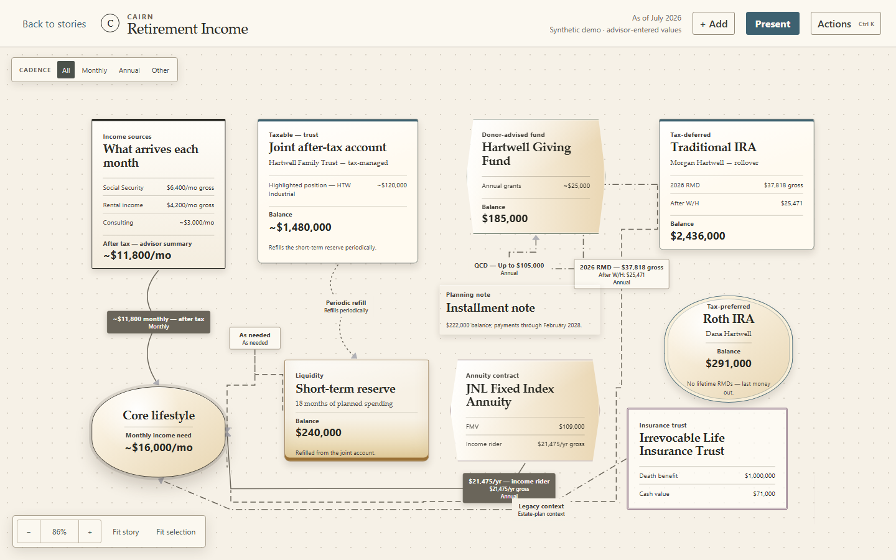
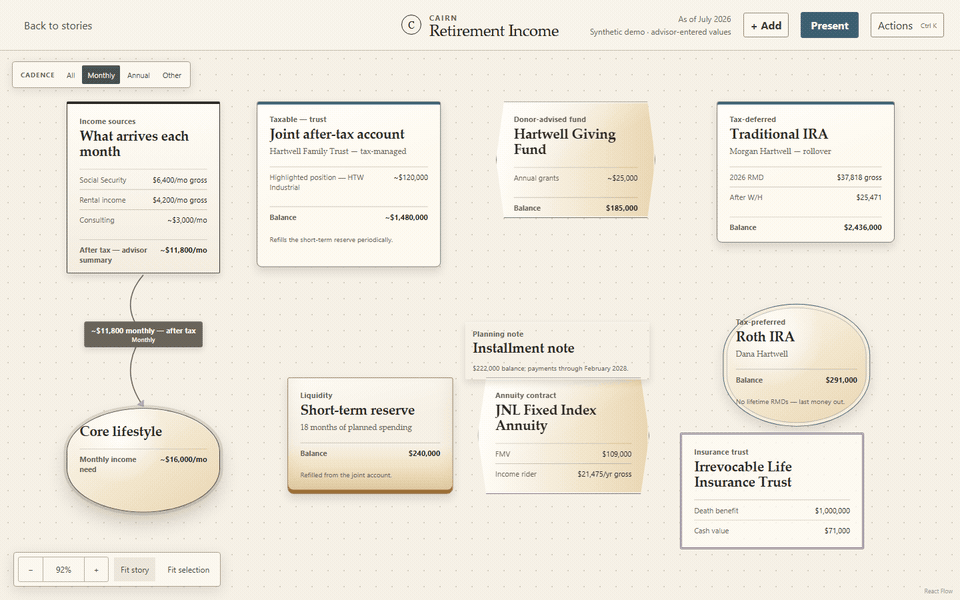
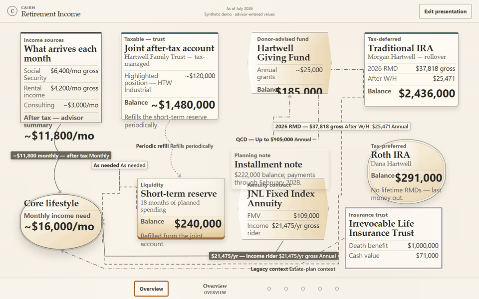

# Cairn Money Map

Money Map turns a household's accounts, income sources, reserves, needs, and relationships into a composed visual story an advisor can shape with the household in front of them. It is a portfolio demonstration of WealthTech product judgment and frontend design engineering—not a financial calculator.

**[▶ Open the live demo](https://cmathew654-dot.github.io/money-map/)** — four starter stories, no sign-in. Authoring needs a viewport of at least 1180 × 660.

## Try the demo locally

```powershell
npm ci
npm run dev
```

Open the address reported by Vite, choose a story, and edit the map. Authoring requires a viewport of at least 1180 × 660; smaller viewports receive an explicit cover instead of a compromised editor.



<details>
<summary>See the authoring and presentation journeys</summary>





</details>

## Four starting stories

- **Retirement Income — Private Ledger:** connects recurring income, household needs, liquidity, accounts, and planned withdrawals.
- **RMD & Withholding — Distribution Registry:** lays out distribution instructions, charitable direction, withholding, net destination, and year-end records.
- **Annuity Income Floor — Foundation:** shows household income, advisor-authored premium planning, an illustrative contract, liquidity, and an income need without implying funding capacity.
- **Roth Conversion — Conversion Path:** stages source and destination accounts, separate 2026 and 2027 windows, outside tax reserves, and planning guardrails.

Each starter has its own visual direction and contains an Overview plus five named focus states. The shared presentation mode keeps the story title, as-of date, and synthetic-data provenance visible while providing direct, keyboard-accessible step navigation.

## Financial boundary

Every financial value is stored and displayed as literal text. Approximation marks, ranges, blanks, cadence phrases, and advisor-authored prose round-trip unchanged.

Money Map does **not** calculate taxes, reconcile balances, annualize cash flows, infer funding capacity, debit accounts, validate recommendations, or use financial values to control geometry, color, weight, routing, or relationship behavior.

## Key interactions

- Add eight purposeful financial-story shapes from one compact menu; select, multi-select, move, duplicate, remove, resize on both axes, rotate in safe 15° steps, and change stacking order.
- Double-click visible module text to edit it directly. Appearance provides shape, priority, detail, curated color, size, and layer controls without exposing a generic diagrammer.
- Connect cards without precision targets: press `C`, click one card, then another. The one-shot mode exits as soon as the relationship is created or found, so cards are immediately draggable again. `Connect to…` — the selection halo, `L`, or the Actions palette — is the keyboard route to the same operation. Labels and bends move independently; endpoints reconnect by pointer or properties.
- Pan and zoom with the pointer, keyboard, or compact on-canvas controls; fit the authored story or current selection.
- Each story opens on its useful Monthly or Annual cadence. All remains available as an explicit overview instead of the crowded default.
- Use the searchable Actions palette (`Ctrl/Cmd+K`) for the same commands exposed contextually by the selection halo and properties.
- Present any story as a read-only Overview plus five named steps; use Arrow keys or Space to advance, direct step controls to jump, and Escape to return to authoring.
- Undo, redo, reset a starter, and restore committed edits from local browser storage.

## Stack

React 19, TypeScript, Vite, React Flow, Vitest, Testing Library, Playwright, ESLint, and Prettier. There is no backend, authentication, cloud sync, collaboration, or arbitrary import/export.

## Build and verify

Node 24 and npm 11 are required.

```powershell
npm ci
npm run format:check
npm run lint
npm run typecheck
npm test
npm run build
npm run check:pages
```

`npm run verify` runs the complete local gate: formatting, lint, TypeScript, unit/component tests, production build, Pages asset validation, the full Chromium journey set, and one bounded WebKit presentation smoke. The Pages check confirms that production assets remain relative and resolvable under a repository subpath.

## Architecture

Starter fixtures feed a typed, literal-safe document model. A shared editor hook owns history and per-starter persistence; a single command registry drives keyboard, palette, halo, and property actions. React Flow is isolated behind canvas adapters and custom module/relationship renderers, while the presentation shell projects the same document into a read-only story without changing financial meaning.

See [architecture](docs/architecture.md), [data provenance](docs/provenance.md), [product intent](PRODUCT.md), and [design contract](DESIGN.md).

## Accessibility

The editor provides keyboard alternatives for core canvas actions, visible focus distinct from selection, focus restoration for transient surfaces, polite live announcements, reduced-motion handling, and labeled modules, relationships, camera controls, tabs, and dialogs. Primary coarse-pointer targets expand to 44 × 44 pixels. Accessibility is covered by component and browser tests, but this portfolio build does not claim independent WCAG certification.

## Demo data and status

Cairn, the Hartwell family, and every displayed scenario are fictional. No real client data, firm logos, or raw reference media is included; see [provenance](docs/provenance.md).

This repository is a portfolio prototype, not production financial-planning software or financial advice.

The live demo above is published by the `Deploy Pages` workflow from the same production build the test suite exercises: every push to `main` builds, validates that assets stay relative and resolvable under the repository subpath, and deploys the artifact.
