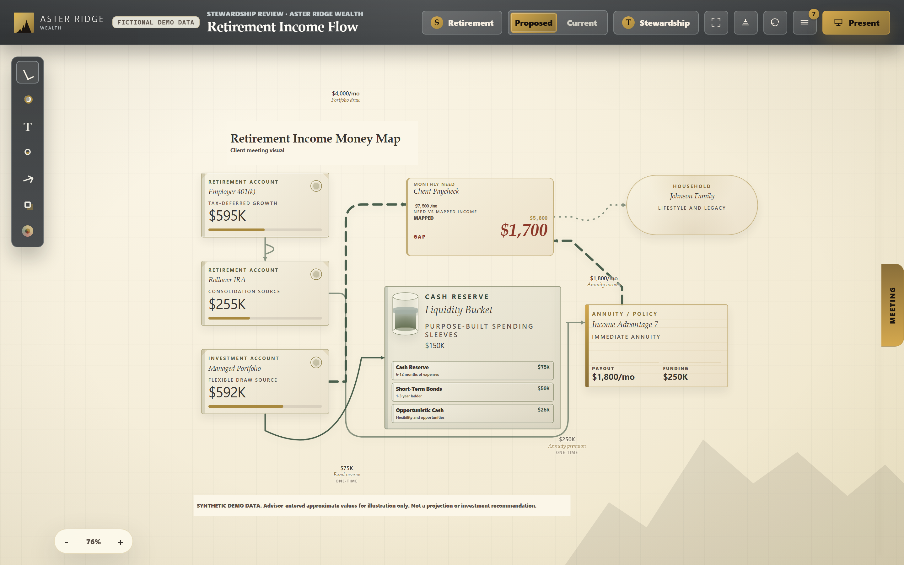
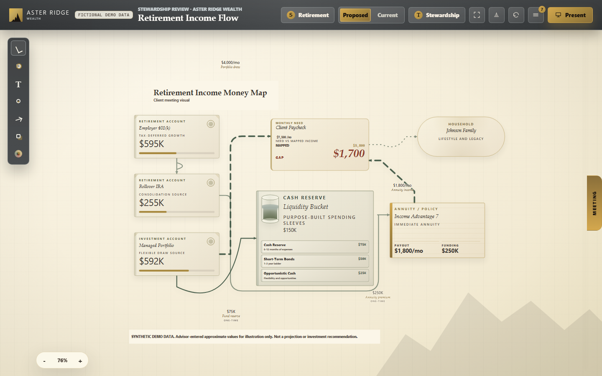
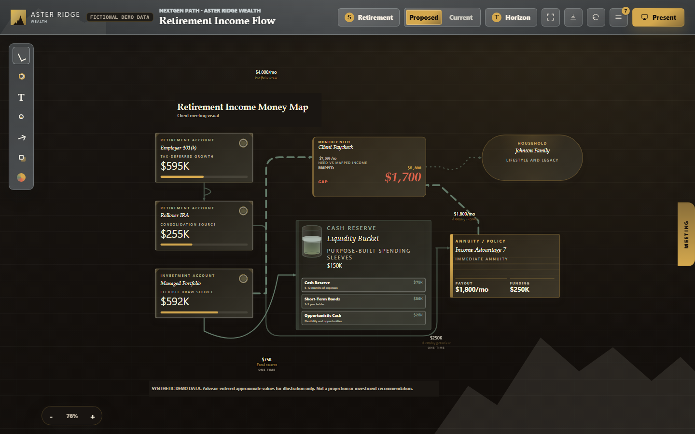
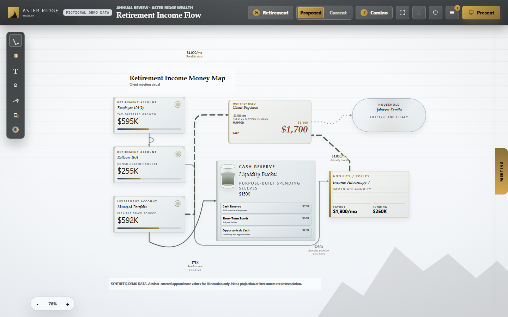
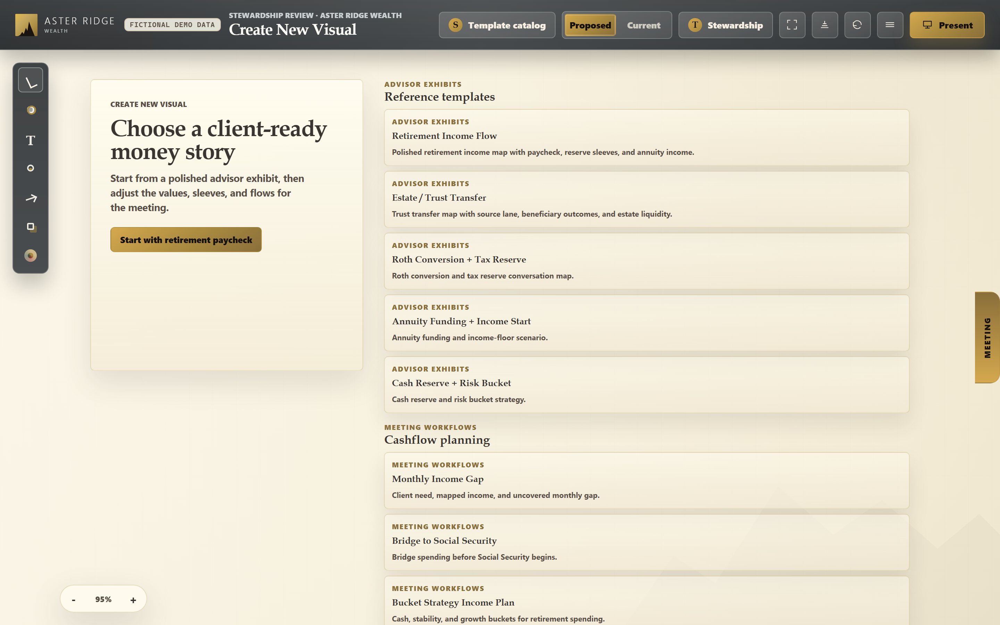
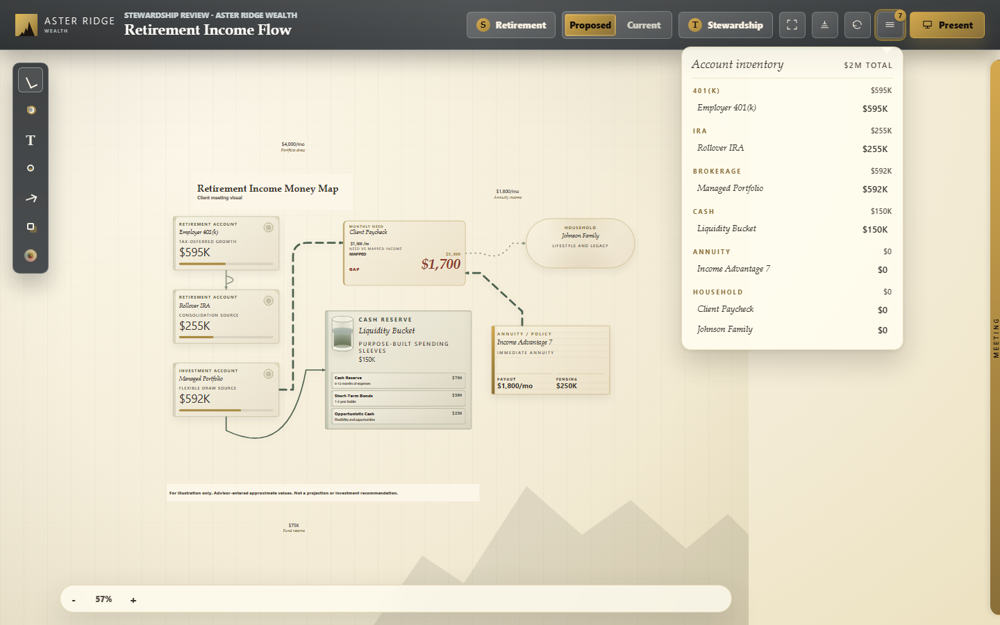
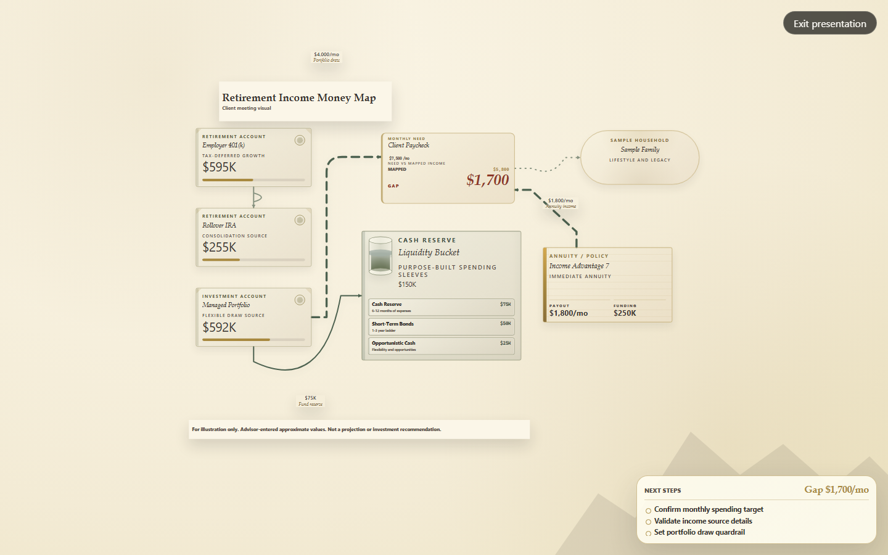

# Money Map

A browser-based canvas for visualizing a client's account structure and the movement of money between accounts during a financial advisory meeting.

**[▶ Try the live demo](https://cmathew654-dot.github.io/money-map/)** — no install, no data entry; it opens on a template catalog of synthetic client scenarios.

  



I'm a practicing financial advisor (Series 7/63/65) and built this after enough PowerPoint money-map slides to want something better. It's one of a small set of tools I've written for my own meeting workflow.

## The problem

Advisors routinely walk clients through where their money sits and how it will move: a 401(k) rolling into an IRA, an IRA funding an annuity, RMDs feeding a cash reserve, a Roth conversion covering its own tax bill. The default tool for this is PowerPoint — static boxes and arrows redrawn by hand for every household, that go stale the moment a number changes mid-meeting.

Money Map is a purpose-built alternative: a tile-and-flow canvas where account balances, transfer amounts, and connector labels stay in sync as the advisor edits a scenario live, in the room.

## Three themes, one meeting language

Every scenario renders in any of three visual themes, switchable mid-meeting.

| Stewardship | Horizon | Camino |
|-|-|-|
|  |  |  |

## Key capabilities

- **Tile canvas** — drag-and-drop account, bucket, policy, and trust tiles (401(k), IRA, brokerage, annuity, liquidity bucket, trust container, household marker), freely positioned on an open canvas.
- **Editable flow connectors** — SVG lines between tiles, each carrying a flow type (rollover, transfer, RMD, annuity premium, Roth conversion, tax payment, fee, rebalance, beneficiary transfer) and an editable dollar amount. Editing a flow updates every value, label, and fill state it touches.
- **Scenario levers** — a scenario rail for adjusting monthly need, mapped income, and gap/surplus without redoing the layout.
- **Multi-select, align, undo/redo** — drag, resize, multi-select with align/distribute controls, full undo/redo history, canvas keyboard shortcuts.
- **Presentation mode** — hides editing chrome, forces the compliance disclosure footer visible, and switches to a client-facing layout for screen share or a conference-room display.
- **Three visual themes** (Stewardship, Horizon, Camino) and 16 preloaded meeting templates — retirement paycheck stack, bucket strategy income plan, RMD + tax withholding flow, Roth conversion + tax reserve, annuity income floor, and more — each preloaded with synthetic household data so the canvas is never empty on first load.

## In the product

**Template catalog** — every meeting starts from a client-ready story, not a blank canvas.


**Editing in context** — the account inventory popover and flow-edit toolbar, open mid-edit.


**Presentation mode** — editing chrome hidden, client-facing layout for screen share.


## What it is not

Money Map has no tax engine. The `taxReservePct` field on a template is a display-only value the advisor types in — the app shows illustrative withholding arithmetic but does not determine a statutory RMD or QCD eligibility, projection, or investment analysis. It's a visualization and communication tool for a meeting, not a planning or compliance engine.

## Tech stack

Deliberately dependency-light: vanilla JavaScript (native ES modules, no framework, no bundler, no build step) rendering to a hybrid canvas — DOM tiles for account and finance cards, SVG for flow lines and connectors. Served locally by `http-server`.

The source is split into seven modules with a one-directional dependency graph (`state → templates → compute → viewport → render → interaction → main`), covered by 448 Playwright end-to-end tests run across three viewport sizes plus a dedicated visual-regression project — 1,365 checks per full run.

| File | Responsibility |
|-|-|
| `src/state.js` | Shared mutable state, constants, utilities |
| `src/templates.js` | Template factories, theme registry |
| `src/compute.js` | Value math and connector geometry |
| `src/viewport.js` | Zoom, pan, fit-to-view |
| `src/render.js` | DOM/SVG rendering, popovers, HUD |
| `src/interaction.js` | Drag, resize, selection, keyboard handling |
| `src/main.js` | Bootstrap and event wiring |

## Running it

```bash
npm install
npm run dev
```

Then open `http://localhost:4173`. The app loads directly into the template catalog — no setup or data import required. (Or skip all of that and use the [hosted demo](https://cmathew654-dot.github.io/money-map/).)

Run the test suite:

```bash
npx playwright test
```

## License

MIT — see [LICENSE](LICENSE).
